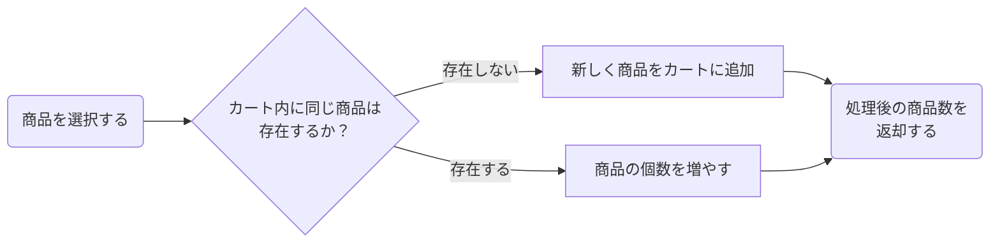
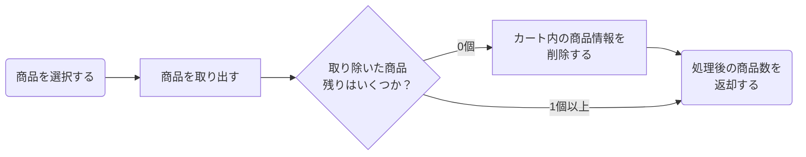
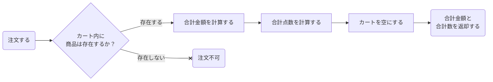

# Flow Chart

_※ このフローチャートには、最低限のアクションのみが記載されています。コードを良くするために必要であれば、エラーハンドリングや判定処理を追加してください。_

## 1. 商品を追加する

```mermaid
flowchart LR
  start(商品を選択する) --> hasProduct{カート内に同じ商品は\n存在するか？}
    hasProduct -- 存在しない --> create[新しく商品をカートに追加]
    hasProduct -- 存在する --> update[商品の個数を増やす]
    create & update --> finish(処理後の商品数を\n返却する)
```

## 2. 商品を取り出す

```mermaid
flowchart LR
  start(商品を選択する) --> remove[商品を取り出す] --> hasProduct{取り除いた商品\n残りはいくつか？}
    hasProduct -- 0個 --> destroy[カート内の商品情報を\n削除する] --> finish
    hasProduct -- 1個以上 --> finish
    finish(処理後の商品数を\n返却する)
```

## 3. 注文する

```mermaid
flowchart LR
  start(注文する) --> hasProducts{カート内に\n商品は存在するか？}
  hasProducts -- 存在する --> calPrice[合計金額を計算する] --> calCount[合計点数を計算する] --> emptyCart[カートを空にする] --> finish(合計金額と\n合計数を返却する)
  hasProducts -- 存在しない --x exception(注文不可)
```
